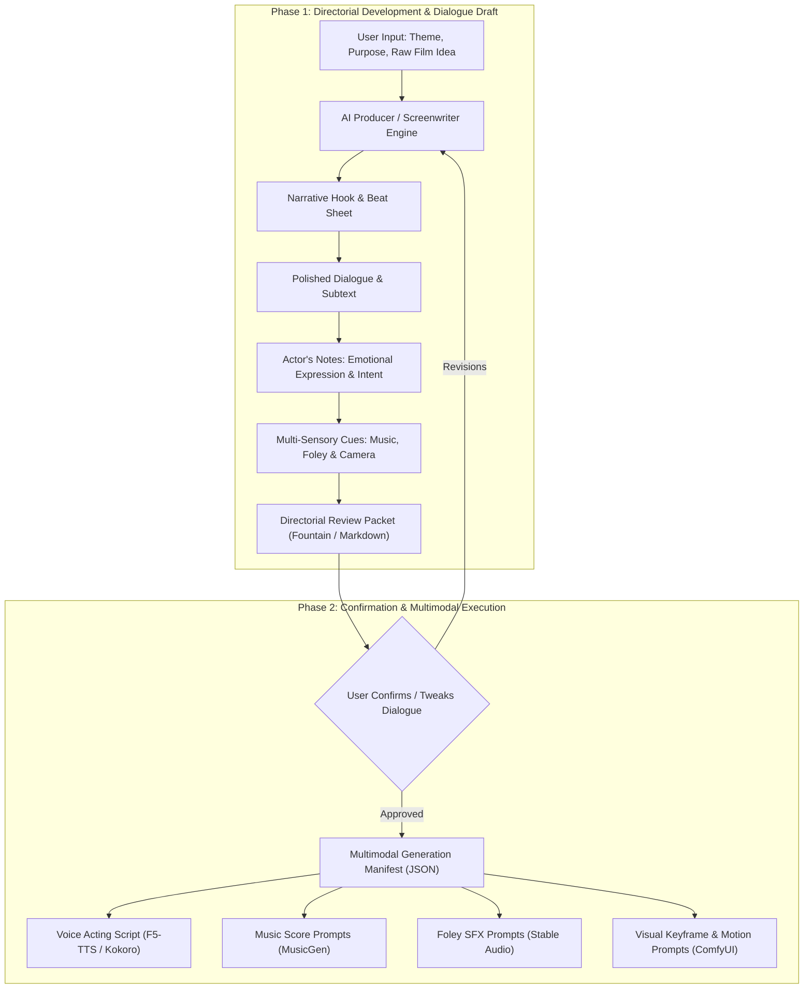

# Cinematic Script & Directorial AI System

## 1. Purpose

This document specifies the architecture, model selection, and prompt choreography for an interactive **AI Screenwriter, Producer & Cinematic Director**. The system transforms fragmented user themes, story concepts, and film premises into fully realized scenes equipped with dialogue, actor direction, and multi-sensory directorial cues (thriller, comedy, horror, emotional hooks, music, voice, and foley sound design).

---

## 2. System Workflow: Two-Phase Director-Producer Loop

---

## 3. Recommended AI Models

| Model | Deployment Tier | Strengths in Screenwriting & Directing | Context / Format |
|---|---|---|---|
| **Qwen 2.5 (32B / 14B)** | Local Ollama (`qwen2.5:32b`, `qwen2.5:14b`) | Exceptional dialogue cadence, genre flexibility, precise JSON extraction | 32k - 128k context |
| **DeepSeek-R1 (14B / 32B)** | Local Ollama (`deepseek-r1:14b`) | Deep narrative reasoning, tension pacing, psychological subtext & twist planning | Long-chain CoT |
| **Llama 3.3 (70B) / 3.1 (8B)** | Local Ollama (`llama3.1:8b`, `llama3.3:70b`) | Authentic colloquial dialogue, genre voice styling, standardized screenplay format | 8k - 128k context |
| **Claude 3.5 Sonnet / GPT-4o** | Cloud API fallback | Literary depth, comedic timing, and complex directorial notes | High precision |

---

## 4. Genre Tone & Sensory Modulation Engines

The director engine modulates four key production tracks according to the requested genre:

| Genre Track | Music Score Cue | Voice & Acting Delivery | Sound & Foley Texture | Camera & Lighting Cue |
|---|---|---|---|---|
| **Thriller** | Low bass drones, dissonant ostinato strings, sudden tempo shifts | Breathless whispers, rapid cadence, suppressed panic | Clock ticking, metallic scrapes, amplified heartbeat | Low-key lighting, Dutch angle, tight claustrophobic framing |
| **Horror** | Sub-bass frequency, scraping waterphone, eerie sudden silence | Trembling vocal fry, choked sobs, sudden piercing screams | Wet floor creaks, guttural breathing, sudden sharp stingers | High contrast chiaroscuro, shadows, slow push-in |
| **Comedy** | Bouncy pizzicato, bright brass stabs, playful syncopated woodwinds | Energetic pitch variation, deadpan pauses, rapid banter | Squeaky steps, cartoon impacts, exaggerated prop rustle | Wide lens, bright high-key lighting, comedic timing cuts |
| **Pixar / 3D Adventure** | Sweeping melodic orchestral, warm French horns, whimsical marimba | Warm, earnest, expressive character inflections, comedic gasps | Magical chimes, pneumatic clicks, tactile cloth swishes | Volumetric golden hour, smooth camera tracking, wide vistas |

---

## 5. Directorial Scene Packet Schema

When presenting the scene to the user for review, the model adheres to a standard 5-part structure:

1. **Scene Header & Atmosphere**: Scene location, time, emotional logline, and core dramatic conflict.
2. **Actor's Directorial Notes (Producer's Guidance)**:
   - *Motivation*: What each character secretly wants in this exact moment.
   - *Subtext*: What the character means beneath what they are saying.
   - *Physical Expression*: Eye contact, facial micro-movements, breathing, body posture.
3. **Dialogue & Beat Breakdown**: Character lines annotated with delivery tone parentheticals `(e.g., struggling to maintain composure)`.
4. **Sensory Score & Audio Tracks**:
   - Music style, instrumentation, and emotional transition cues.
   - Layered foley effects mapped to character action beats.
5. **Confirmation Gate**: Actionable prompt asking the user to approve the dialogue or specify adjustments before generating the technical production manifest.
