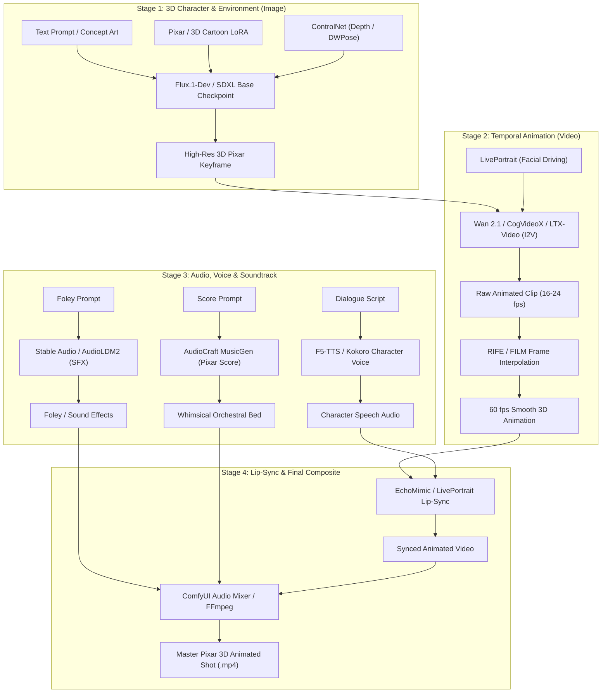

# ComfyUI Pixar & 3D Animation Multimodal Architecture

## 1. Purpose

This document outlines the architecture, model ecosystem, and operational integration for producing Pixar- and Disney-style 3D animated content inside ComfyUI on the ModelBox platform. The pipeline spans three core generative modalities:
1. **3D Stylized Image Generation**: Stylized character and scene generation with volumetric lighting, subsurface scattering, and characteristic cartoon proportions.
2. **Video & Motion Generation**: Temporal animation of characters, dynamic camera moves, and expressive facial performance.
3. **Audio & Lip-Sync Generation**: Orchestral film scoring, cartoon foley sound effects, expressive character voice acting, and automated audio-driven lip synchronization.

---

## 2. Multimodal Pipeline Architecture



---

## 3. Modality & Model Stack Matrix

| Modality | Primary Models | Precision / Formats | Primary ComfyUI Nodes |
|---|---|---|---|
| **Image (Base)** | Flux.1-Dev, SDXL (PixarXL, Juggernaut XL) | FP8-e4m3fn, BF16, GGUF Q4/Q8 | `UNETLoader`, `CheckpointLoaderSimple` |
| **Image (Style)** | Shakker-Labs Pixar LoRA, 3D Clay LoRA | FP16 safetensors | `LoraLoader`, `LoraLoaderModelOnly` |
| **Image (Control)** | ControlNet Depth (Zoe/Anyline), DWPose | FP16 safetensors | `ControlNetApplyAdvanced`, `ApplyControlNet` |
| **Video (I2V/T2V)** | Wan 2.1 (14B/1.3B), CogVideoX-5B, LTX-Video | FP8, GGUF, BF16 | `WanVideoSampler`, `CogVideoSampler` |
| **Video (Face/Lip)** | LivePortrait, EchoMimic v2, SadTalker | ONNX, FP16 safetensors | `LivePortraitProcess`, `EchoMimicNode` |
| **Audio (SFX)** | Stable Audio Open 1.0, AudioLDM 2 | FP16, safetensors | `StableAudioSampler`, `AudioLDMLoader` |
| **Audio (Score)** | Meta AudioCraft / MusicGen (Stereo-Medium) | FP16, PyTorch | `AudioCraftLoader`, `MusicGenSampler` |
| **Audio (Voice)** | F5-TTS, Kokoro-82M, Bark | PyTorch, ONNX, GGUF | `F5TTSNode`, `KokoroTTS` |

---

## 4. Hardware Sizing & Memory Profiles

| Hardware Target | Primary VRAM Allocation | Recommended Pipeline Config |
|---|---|---|
| **RTX 4090 / A5000 (24 GB)** | Full FP8/BF16 in VRAM | Full Flux.1-Dev + Wan 2.1 14B (FP8) + LivePortrait in single runtime. |
| **RTX 5080 / 4080 (16 GB)** | Quantized FP8 / GGUF | Flux.1-Dev (FP8) or SDXL + CogVideoX-5B (FP8) / Wan 2.1 (7B/1.3B) with CPU offload. |
| **RTX 4070 / 3060 (8-12 GB)** | Aggressive GGUF / Sequential | SDXL Pixar checkpoints + LTX-Video 0.9.1 / AnimateDiff + Kokoro-82M TTS. |

---

## 5. ModelBox Storage Layout

Under the ModelBox Docker environment (`./volumes/comfyui`), models are mounted into `/data/comfyui/` according to standard ComfyUI categories:

```text
/data/comfyui/
├── checkpoints/          # SDXL PixarXL, Juggernaut XL, SD 1.5 checkpoints
├── diffusion_models/     # Flux.1-dev, Wan 2.1, CogVideoX, LTX-Video, Hunyuan
├── loras/                # Pixar 3D LoRAs, Character Style LoRAs
├── text_encoders/        # t5xxl_fp8_e4m3fn, clip_l, clip_g
├── vae/                  # sdxl_vae.safetensors, ae.safetensors, wan_vae.safetensors
├── controlnet/           # controlnet-depth, controlnet-openpose
├── audio_encoders/       # AudioLDM2, Stable Audio Open, MusicGen checkpoints
└── workflows/            # Exported JSON templates for 3D generation pipelines
```

---

## 6. Document Navigation

- [Pixar 3D Image Models](comfyui-pixar-image-models.md) - Checkpoints, LoRAs, prompt engineering, and sampler setups.
- [Pixar 3D Video Models](comfyui-pixar-video-models.md) - Video diffusion models, temporal consistency, and facial puppetry.
- [Pixar 3D Audio Models](comfyui-pixar-audio-models.md) - Sound effects, orchestral scoring, character voice, and lip-sync.
- [Pixar 3D Operational Runbook](comfyui-pixar-pipeline-runbook.md) - Download commands, custom nodes, and container execution.
