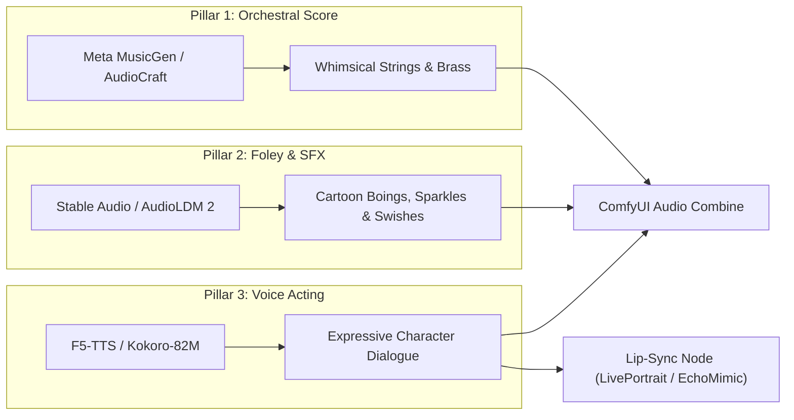

# ComfyUI Pixar 3D Audio, Soundtrack & Voice Generation Models

## 1. Purpose

This document catalogs models, nodes, and conditioning recipes for synthesizing Pixar-style orchestral film scores, cartoon foley sound effects, expressive character voice acting, and audio-driven lip synchronization inside ComfyUI.

---

## 2. Three Pillars of Pixar Audio Production

Authentic Pixar and Disney animated productions rely on a balanced tri-part audio architecture:



---

## 3. Pillar 1: Orchestral Score & Music Generation

| Model | Model Family | Pixar Style Capability | ComfyUI Node | Checkpoint |
|---|---|---|---|---|
| **MusicGen Stereo Medium** | AudioCraft (1.5B) | High-fidelity orchestral arrangements, strings, flutes, brass | `ComfyUI-AudioCraft` | `facebook/musicgen-stereo-medium` |
| **MusicGen Melody** | AudioCraft (1.5B) | Guided scoring following a reference melody hummed or MIDI-fed | `ComfyUI-AudioCraft` | `facebook/musicgen-melody` |
| **Stable Audio Open 1.0** | Stable Audio (Diffusion) | Ambient emotional scoring, transitions, cinematic crescendos | `ComfyUI-StableAudio` | `stabilityai/stable-audio-open-1.0` |

### Orchestral Score Prompt Recipes
- **Whimsical Adventure Theme**:
  ```text
  Whimsical orchestral soundtrack in the style of Pixar animation, playful pizzicato strings, cheerful flute melodies, warm french horns, light marimba, lighthearted brass swells, cinematic mixing, dynamic adventure theme, high production value.
  ```
- **Emotional Heartfelt Theme**:
  ```text
  Emotional cinematic orchestral theme, gentle piano opening, lush cello counter-melody, warm violins, nostalgic and inspiring, Disney Pixar film score, bittersweet resolution, studio recorded master.
  ```

---

## 4. Pillar 2: Cartoon Foley & Sound Effects (SFX)

Cartoons rely on exaggerated, tactile sound effects:

| Engine | Model Checkpoint | Foley Specialization | Sample Rate / Format |
|---|---|---|---|
| **Stable Audio Open 1.0** | `stable-audio-open-1.0.safetensors` | Precise timing, mechanical sounds, magic whooshes, ambient room tones | 44.1 kHz, 16-bit WAV |
| **AudioLDM 2** | `audioldm2-full.safetensors` | Cartoon impacts, comical boings, squishy footsteps, creature vocalizations | 16 kHz / 48 kHz |

### Foley Prompt Recipes
- **Magic Sparkle / Invention**: `Magical chime sparkle sound effect, bright glockenspiel twinkle, gentle high-frequency shimmer, whimsical cartoon invention activation, clean isolated sound.`
- **Cartoon Stumble / Impact**: `Comedic cartoon boing sound effect, funny jaw harp bounce, wooden wobble impact, classic animated short foley.`

---

## 5. Pillar 3: Character Voice Acting & TTS

Expressive, character-driven text-to-speech requires emotion, comedic timing, and zero-shot voice cloning:

| Engine | Node Extension | Strengths | Processing Speed |
|---|---|---|---|
| **F5-TTS / E2-TTS** | `ComfyUI-F5-TTS` | State-of-the-art expressive zero-shot voice cloning with laughter, gasps, and emotional inflection | ~0.3x Real-Time (Fast) |
| **Kokoro-82M** | `ComfyUI-Kokoro` | Ultra-lightweight (82M params), natural cadence, American cartoon voice profiles | >15x Real-Time (Instant) |
| **Bark** | `ComfyUI-Bark` | Embedded non-verbal expressions (`[laughter]`, `[sighs]`, `[gasps]`) | Moderate |

---

## 6. Lip-Sync & Multimodal Video-Audio Assembly

To finalize the animated cut inside ComfyUI:

1. **Extract Audio Phonemes**: Send the generated voice `.wav` from F5-TTS to the `EchoMimic` or `LivePortrait-Audio` node.
2. **Drive Keyframe Mesh**: The audio node synchronizes lip and jaw landmarks with the video frames generated in Stage 2.
3. **Mux Audio & Video Streams**:
   - Node: `VHS_VideoCombine` (from `ComfyUI-VideoHelperSuite`).
   - Inputs:
     - `images`: Interpolated 60 fps frames from Stage 2.
     - `audio`: Mixed audio track (Speech dialogue at 0 dB, SFX at -3 dB, Music at -12 dB).
   - Container Output: `H.264 / AAC MP4` with embedded pixel and audio synchronization.
