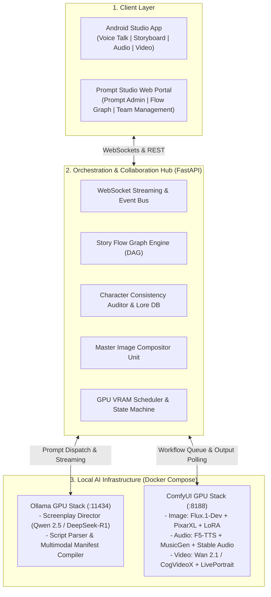
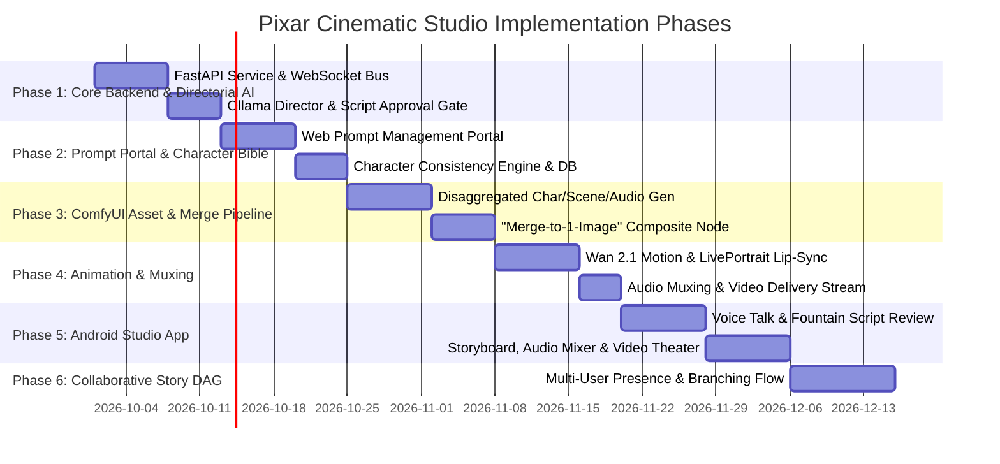

# Pixar Cinematic Studio: Master Architecture & Implementation Plan

## 1. Executive Summary

The **Pixar Cinematic Studio** is an enterprise multimodal platform designed to produce complete 3D Pixar-style animated short films and episodic stories. It bridges conversational AI directing with local generative diffusion and audio pipelines, accommodating both **solo creators** and **distributed creative teams**.

The platform is anchored around five core capabilities:
1. **Android Studio Client**: Continuous hands-free voice talk, Fountain script review, storyboard browsing, multi-track audio playback, and full-screen synchronized video playback.
2. **Backstage Prompt Portal**: Web console to configure, version, and evaluate backstage system prompts and dynamic user prompt composition.
3. **Collaborative Story Flow (DAG)**: Node-based graph progression (Google Flow style) supporting branching narratives and role-based team collaboration.
4. **Character Consistency Engine**: Persistent Character Bible that strictly enforces character names, visual DNA, and voice profiles across shots.
5. **"Merge-to-1-Image" Composite Pipeline**: Disaggregated generation of character, scene background, and audio stems, fused into a single canonical keyframe before video motion rendering.

---

## 2. End-to-End System Topology



---

## 3. Master Architectural Router

Every core system capability is comprehensively detailed in dedicated specifications. Use the routing table below to navigate to the detailed operational blueprints:

| Functional Area | Primary Focus | Detailed Specification Document |
|---|---|---|
| **Directorial AI System** | Screenwriter agent persona, emotional modulation matrices, 5-part scene packet schema, and confirmation gate. | [cinematic-script-director-system.md](cinematic-script-director-system.md) |
| **Director Prompts & Manifests** | Ollama `Modelfile.director`, prompt templates, interactive screenplay walkthrough, and JSON manifest schemas. | [cinematic-script-director-templates.md](cinematic-script-director-templates.md) |
| **Studio Architecture & Portal** | Team/Single-user DAG flow, backstage Prompt Studio Portal, and Android Jetpack Compose client architecture. | [pixar-cinematic-studio-system.md](pixar-cinematic-studio-system.md) |
| **Backend & Pipeline Engine** | Multimodal execution, Character Bible schema, ComfyUI "Merge-to-1" fusion, VRAM arbitration, and API contracts. | [pixar-cinematic-pipeline-implementation.md](pixar-cinematic-pipeline-implementation.md) |
| **ComfyUI Pixar 3D Overview** | Multimodal pipeline topology, host volume mappings, and GPU VRAM budget. | [comfyui-pixar-3d-overview.md](comfyui-pixar-3d-overview.md) |
| **Pixar Image Generation** | Flux.1-Dev / SDXL checkpoints, dedicated Pixar LoRAs, ControlNet depth, and prompt recipes. | [comfyui-pixar-image-models.md](comfyui-pixar-image-models.md) |
| **Pixar Video Generation** | Wan 2.1 / CogVideoX I2V, LivePortrait facial expression driving, and RIFE frame interpolation. | [comfyui-pixar-video-models.md](comfyui-pixar-video-models.md) |
| **Pixar Audio & Voice** | Meta MusicGen scores, Stable Audio cartoon foley, F5-TTS voice acting, and audio muxing. | [comfyui-pixar-audio-models.md](comfyui-pixar-audio-models.md) |
| **Deployment Runbook** | Volume directory hierarchy, custom nodes installation, and model weights download registry. | [comfyui-pixar-pipeline-runbook.md](comfyui-pixar-pipeline-runbook.md) |

### 3.1 Automated Model Provisioning Commands

All weights are downloaded into `./volumes/comfyui` via the automated orchestrator [`infra/scripts/Download-Pixar-Models.ps1`](../infra/scripts/Download-Pixar-Models.ps1) and mapped into ComfyUI via [`extra_model_paths.yaml`](../applications/ai-ml-applications/repo_comfyui/extra_model_paths.yaml).

```powershell
# 1. Essential Baseline (Ready: RealCartoon 3D Checkpoint 5.5GB, Canopus LoRA 435MB, SDXL VAE 319MB, F5-TTS 1.28GB)
powershell.exe -ExecutionPolicy Bypass -File "./infra/scripts/Download-Pixar-Models.ps1" -Tier "Essential"

# 2. ControlNet Spatial Tier (Depth SDXL & OpenPose SDXL - ~10 GB)
powershell.exe -ExecutionPolicy Bypass -File "./infra/scripts/Download-Pixar-Models.ps1" -Tier "ControlNet"

# 3. Audio Tier (MusicGen Medium Orchestral Score & F5-TTS - ~4.9 GB)
powershell.exe -ExecutionPolicy Bypass -File "./infra/scripts/Download-Pixar-Models.ps1" -Tier "Audio"

# 4. Video Diffusion & Motion Tier:
# 4a. LivePortrait Facial Puppetry (~150 MB - Installed & Ready)
powershell.exe -ExecutionPolicy Bypass -File "./infra/scripts/Download-Pixar-Models.ps1" -Tier "Video" -VideoEngine "LivePortrait"

# 4b. LTX-Video v0.9.5 (~6.3 GB - Ultra-Fast Prototyping)
powershell.exe -ExecutionPolicy Bypass -File "./infra/scripts/Download-Pixar-Models.ps1" -Tier "Video" -VideoEngine "LTX"

# 4c. Wan 2.1/2.2 I2V 14B FP8 + VAE (~17.2 GB - Master Pixar Character Animation)
powershell.exe -ExecutionPolicy Bypass -File "./infra/scripts/Download-Pixar-Models.ps1" -Tier "Video" -VideoEngine "Wan"

# 4d. HunyuanVideo 720p CFG-Distill FP8 + VAE (~13.6 GB - Wide Cinematic Sweeps)
powershell.exe -ExecutionPolicy Bypass -File "./infra/scripts/Download-Pixar-Models.ps1" -Tier "Video" -VideoEngine "Hunyuan"

# 5. Full Studio Suite (All Models across all categories)
powershell.exe -ExecutionPolicy Bypass -File "./infra/scripts/Download-Pixar-Models.ps1" -Tier "All"
```

---

## 4. End-to-End Production Lifecycle

```mermaid
sequenceDiagram
    autonumber
    actor User as Creator / Team (Android / Web)
    participant Back as Backend Gateway
    participant Portal as Prompt Portal
    participant Ollama as Ollama Director
    participant Comfy as ComfyUI Engine

    User->>Back: Continuous Voice / Chat ("Pip is afraid to fly...")
    Back->>Portal: Fetch active system prompt & character traits
    Portal-->>Back: Injected system prompt + persona parameters
    Back->>Ollama: Generate Screenplay Packet
    Ollama-->>Back: Stream Screenplay Draft & Director Notes
    Back-->>User: Render Script Review Sheet & Confirmation Gate
    User->>Back: "CONFIRMED" (Official Approval Lock)
    
    rect rgb(30, 40, 60)
        Note over Back,Comfy: Disaggregated Synthesis Phase
        Back->>Comfy: 1. Generate Isolated Character (Flux + LoRA)
        Back->>Comfy: 2. Generate Isolated Scene Plate (PixarXL)
        Back->>Comfy: 3. Generate Audio Stems (F5-TTS, MusicGen, SFX)
        Comfy-->>Back: Character PNG + Scene PNG + Audio Stems
    end

    rect rgb(40, 50, 40)
        Note over Back,Comfy: Master Composite "Merge-to-1" Phase
        Back->>Comfy: 4. RMBG Matte + Depth ControlNet + Harmonization KSampler
        Comfy-->>Back: Canonical Merged Master Image
    end

    rect rgb(60, 40, 40)
        Note over Back,Comfy: Animation & Final Assembly Phase
        Back->>Comfy: 5. Wan 2.1 I2V Motion + LivePortrait Lip-Sync
        Back->>Comfy: 6. FFmpeg Mux Video + Audio Stems (60fps)
        Comfy-->>Back: Final Master MP4 Video
    end

    Back-->>User: Push Storyboard, Multi-Track Audio & Synced Video
```



---

## 5. Engineering Roadmap & Implementation Milestones


