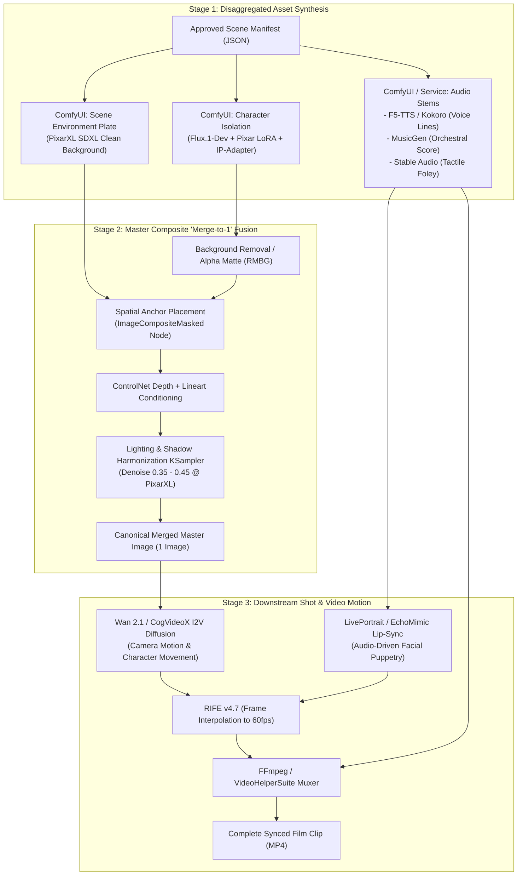

# Pixar Cinematic Pipeline: Backend Aggregator, Character Consistency & Multimodal Generation

## 1. Executive Purpose

This document details the technical implementation of the **Pixar Cinematic Pipeline**. It specifies how the backend aggregates Ollama reasoning and ComfyUI image, audio, and video synthesis to produce fully rendered 3D animated shorts while enforcing strict **Character Consistency** and executing the **"Merge-to-1-Image" Composite Strategy**.

---

## 2. Multimodal Generation & "Merge-to-1-Image" Architecture

To maintain the authentic tactile quality, soft volumetric lighting, and character fidelity of modern Pixar films without prompt bleeding, the pipeline disaggregates asset creation into isolated stages before compositing.



### 2.1 The "Merge-to-1-Image" Procedure
1. **Character Isolation**: Character is generated in high-resolution with clean topology and neutral lighting. The alpha channel is extracted via `ComfyUI-BRIA-RMBG`.
2. **Scene Environment Plate**: The environment (e.g. clock tower attic at sunset) is rendered with matching camera focal length and perspective, with zero characters present.
3. **Spatial Anchoring & Fusion**: Character layer is composited onto the plate at precise depth coordinates.
4. **Harmonization Pass**: A low-denoise KSampler pass (`0.35 - 0.45`) with `controlnet-depth-sdxl-1.0` unifies ambient occlusion, soft subsurface scattering (SSS), and contact shadows, outputting the **Master Merged Image**.
5. **Downstream Shot Expansion**: All multi-angle camera shots, close-ups, and I2V video animations reference this verified master image to prevent visual drift.

---

## 3. Character Consistency & Lore Master Engine

A primary point of failure in generative cinematic storytelling is character drift (e.g., changing clothing, shifting facial proportions, or LLM hallucinating character names).

### 3.1 Character Bible Data Schema

```json
{
  "character_id": "char_pip_clockwork",
  "project_id": "proj_pips_gears",
  "canonical_name": "Pip",
  "aliases": ["Pip", "The Clockwork Songbird"],
  "species": "Clockwork Songbird",
  "visual_dna": {
    "body": "Small round brass clockwork bird, intricate polished copper feather plates, exposed ticking chest gears",
    "eyes": "Luminous amber glass vacuum-tube eyes with warm interior glow",
    "imperfections": "Misaligned pinion gear that squeaks and emits faint blue sparks during rapid movement",
    "lora_triggers": "pixar style, 3d animation, intricate brass bird, clockwork mechanisms, octane render",
    "negative_prompt": "biological feathers, flesh, flat textures, photorealistic real bird, deformed cogs"
  },
  "ip_adapter_asset": "/data/characters/pip_canonical_face.png",
  "voice_dna": {
    "voice_model": "F5-TTS",
    "speaker_reference": "/data/audio/voices/pip_warm_anxious.wav",
    "base_pacing": 1.2,
    "base_pitch": 1.15
  }
}
```

### 3.2 Consistency Enforcement Protocol
1. **Pre-LLM Prompt Guard**: Injects the active Character Bible into every Ollama prompt.
2. **Post-LLM Entity Validator**: Parses generated scripts for character mentions. If the LLM generates `"Pipkin"` or introduces an unregistered character, the engine rejects the draft or automatically remaps it to canonical keys.
3. **Visual Seed & Embedding Locking**: Whenever ComfyUI generates a scene containing Pip, the backend automatically injects the canonical `ip_adapter_asset` reference image and LoRA weights (`FLUX.1-dev-LoRA-Pixar-Cartoon` @ `0.85`).

---

## 4. API Protocol & WebSocket Specifications

### 4.1 Real-Time WebSocket Channel (`/ws/projects/{project_id}/live`)

All collaborative voice chat, script progression, and generation telemetry stream through a unified event bus.

#### Event: Client Audio / Text Stream
```json
{
  "event": "USER_DIRECTORIAL_INPUT",
  "user_id": "user_lead_director",
  "timestamp": "2026-09-30T19:45:00Z",
  "payload": {
    "input_type": "AUDIO_OR_TEXT",
    "text": "Let's increase the storm tension. Barnaby should sound more reassuring."
  }
}
```

#### Event: Director Streaming Script Packet
```json
{
  "event": "DIRECTOR_SCRIPT_CHUNK",
  "scene_id": "scene_001",
  "status": "STREAMING",
  "chunk": "BARNABY\n(eyes glowing with warm amber vacuum-tube light)\nIt isn't a flaw, little one. It's syncopation."
}
```

#### Event: Official Approval Confirmation Gate
```json
{
  "event": "CONFIRM_SCENE_APPROVAL",
  "scene_id": "scene_001",
  "approved_by": "user_lead_director",
  "confirmed": true
}
```

#### Event: Multimodal Generation Telemetry
```json
{
  "event": "GENERATION_STAGE_PROGRESS",
  "scene_id": "scene_001",
  "current_stage": "MERGING_TO_ONE_IMAGE",
  "stage_index": 3,
  "total_stages": 5,
  "progress_percentage": 60,
  "artifacts": {
    "character_still_url": "/cdn/assets/scene_001_char_pip.webp",
    "scene_plate_url": "/cdn/assets/scene_001_bg_clocktower.webp",
    "master_merged_image_url": "/cdn/assets/scene_001_master_composite.webp",
    "voice_track_url": "/cdn/assets/scene_001_voice.wav",
    "music_track_url": "/cdn/assets/scene_001_score.wav",
    "video_preview_url": null
  }
}
```

---

## 5. Docker Integration & GPU Resource Management

The backend integrates with the existing ModelBox Docker infrastructure (`model-box-net`):

```yaml
# Addition to infra/compose/compose.studio-backend.yaml
services:
  studio-backend:
    build:
      context: ../../applications/studio-backend
      dockerfile: Dockerfile
    environment:
      - OLLAMA_HOST=http://ollama:11434
      - COMFYUI_HOST=http://comfyui:8188
      - COMFYUI_WS_HOST=ws://comfyui:8188/ws
      - ASSET_STORAGE_ROOT=/data/storage
    ports:
      - "8000:8000"
    volumes:
      - ./volumes/comfyui:/data/comfyui
      - studio-storage:/data/storage
    networks:
      - model-box-net
```

### GPU VRAM Arbitration (RTX Series)
To prevent out-of-memory (OOM) collisions when running large Ollama models (`qwen2.5:32b`, `deepseek-r1:14b`) alongside ComfyUI diffusion models (`flux1-dev`, `wan2.1`):
1. **Scripting Phase**: Ollama loads weights into VRAM. ComfyUI remains idle.
2. **Handoff & VRAM Offloading**: Upon user script approval, the backend calls `POST http://ollama:11434/api/generate` with `keep_alive: 0` to release Ollama's VRAM allocation.
3. **Multimodal Rendering Phase**: ComfyUI executes character generation, merging, audio, and video synthesis utilizing the entire GPU memory pool.
### 5.2 Model Volume Topology & Automated Provisioning

Host volume `./volumes/comfyui` binds to `/data/comfyui` in the ComfyUI container. Custom model discovery is configured in `applications/ai-ml-applications/repo_comfyui/extra_model_paths.yaml`.

To provision models across production tiers with auto-resuming and retry policies, execute:

```powershell
# Essential Tier (RealCartoon 3D Checkpoint, Pixar LoRA, SDXL VAE, F5-TTS - Ready)
powershell.exe -ExecutionPolicy Bypass -File "./infra/scripts/Download-Pixar-Models.ps1" -Tier "Essential"

# Specialized Production Tiers:
powershell.exe -ExecutionPolicy Bypass -File "./infra/scripts/Download-Pixar-Models.ps1" -Tier "ControlNet"
powershell.exe -ExecutionPolicy Bypass -File "./infra/scripts/Download-Pixar-Models.ps1" -Tier "Audio"

# Video Engines (LTX v0.9.5 Prototyping / Wan 2.1/2.2 Master Character / Hunyuan Cinematic Sweeps):
powershell.exe -ExecutionPolicy Bypass -File "./infra/scripts/Download-Pixar-Models.ps1" -Tier "Video" -VideoEngine "LTX"
powershell.exe -ExecutionPolicy Bypass -File "./infra/scripts/Download-Pixar-Models.ps1" -Tier "Video" -VideoEngine "Wan"
powershell.exe -ExecutionPolicy Bypass -File "./infra/scripts/Download-Pixar-Models.ps1" -Tier "Video" -VideoEngine "Hunyuan"

# Full Studio Suite:
powershell.exe -ExecutionPolicy Bypass -File "./infra/scripts/Download-Pixar-Models.ps1" -Tier "All"
```

---

## 6. Phased Implementation Roadmap

| Phase | Milestone | Deliverables | Verification Criterion |
|---|---|---|---|
| **Phase 1** | Backend Service & Ollama Director | FastAPI service, WebSocket hub, Ollama `Modelfile.director` connection, script approval gate. | User can talk via WebSocket and receive structured 5-part screenplay packets with approval triggers. |
| **Phase 2** | Prompt Portal & Character Bible | Web portal for editing system/user prompts, Character Bible database, entity auditor. | Prompts can be dynamically modified without restarts; character names/traits remain consistent across turns. |
| **Phase 3** | ComfyUI Separate Generation & Merge | ComfyUI REST/WS client, isolated Character workflow, Scene plate workflow, "Merge-to-1" composite node. | System generates isolated character + scene and successfully produces 1 harmonized master keyframe. |
| **Phase 4** | Audio, Video Motion & Muxing | F5-TTS, MusicGen, Stable Audio workflows, Wan 2.1 / LivePortrait lip-sync, FFmpeg muxer. | Complete 60-second video rendered with lip-synced character speech, background score, and foley. |
| **Phase 5** | Android Studio App (Compose) | Jetpack Compose app: continuous talk, script review dialog, storyboard viewer, multi-track audio, video theater. | End-to-end voice prompt on Android results in full playable animated film on mobile device. |
| **Phase 6** | Multi-User Team Collaboration | Project DAG flow engine, node locking, live presence, collaborative review rooms. | Multiple users on Android and Web Portal simultaneously collaborate on a shared story timeline. |
