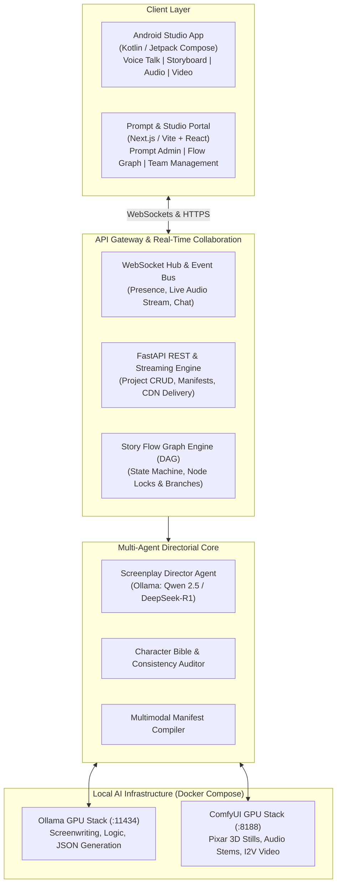
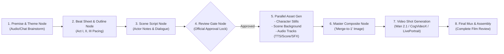
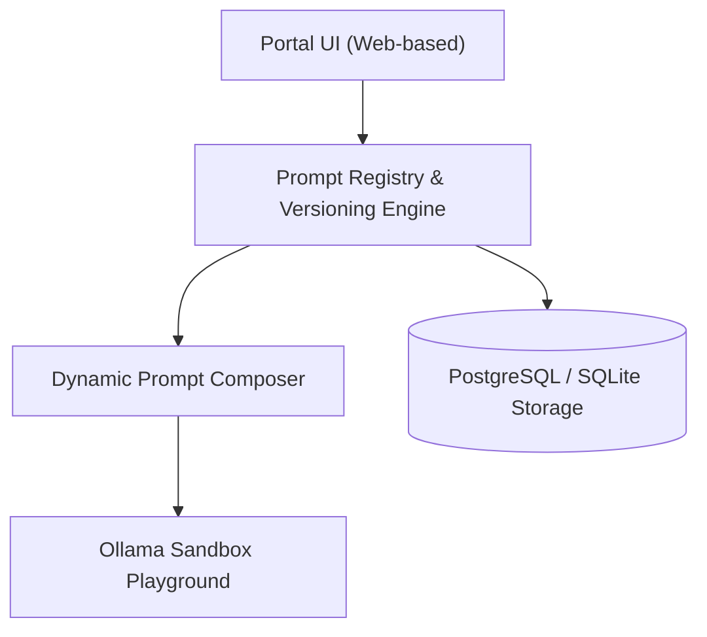

# Pixar Cinematic Studio: System Architecture & Collaboration Specification

## 1. Executive Purpose

This document specifies the enterprise architecture for **Pixar Cinematic Studio**, a collaborative multimodal platform enabling single creators or distributed creative teams to brainstorm, script, direct, and produce complete 3D Pixar-style animated short films and episodic stories.

The system combines:
1. An **Android Client** with continuous voice talk, screenplay review, storyboard viewing, multi-track audio playback, and synchronized video playback.
2. A **Collaborative Story Flow Engine** supporting single-user and team workflows via a directed acyclic graph (DAG) structure.
3. A **Studio Prompt Portal** for managing, versioning, and testing backstage system prompts and dynamic user prompt composition.
4. An **Aggregated Multi-Agent Backend** backed by local Ollama LLMs and ComfyUI diffusion/audio/video engines.

---

## 2. High-Level System Architecture



---

## 3. Team & Single-User Collaborative Story Flow (DAG)

The platform models every film or episodic project as a **Story Flow Graph (DAG)** inspired by node-based creative production pipelines (similar to Google Flow / workflow graphs).

### 3.1 Flow Graph Node Hierarchy



### 3.2 Single-User vs. Team Collaboration Modes

| Mode | Capability | Access Control & Concurrency |
|---|---|---|
| **Solo Creator** | Full ownership of all stages; autonomous voice/chat iteration from idea to final muxed video. | Single session lock; instant autosave; non-blocking background AI queues. |
| **Team Production** | Multi-user room with distinct creative roles: *Executive Producer*, *Director / Screenwriter*, *Art Director*, *Sound Designer*. | Real-time presence; node-level granular locking (pessimistic lock on active node edit, optimistic on branches); live cursor/typing indicators. |

### 3.3 Collaboration Primitives
1. **Live Presence & Voice Rooms**: Team members can join the project's audio room to brainstorm simultaneously while the Director Agent listens and responds.
2. **Branching Story Exploration**: Creators can branch off any Beat or Script Node (e.g., `Scene 1 - Alternate Ending: Pip takes flight early`) to render alternative visual and audio cuts without modifying the canonical master timeline.
3. **Approval Gating**: Script nodes transition through `DRAFT` $\rightarrow$ `IN_REVIEW` $\rightarrow$ `OFFICIALLY_APPROVED`. Only approved nodes can trigger downstream ComfyUI rendering pipelines.

---

## 4. Backstage Prompt Management Portal

The **Prompt Studio Portal** empowers prompt engineers and directors to modify, test, and version backstage system and user prompts without redeploying code.

### 4.1 Architecture & Capabilities



1. **System Prompt Customization**:
   - Live editing of the Director System Prompt, Emotional Modulation Matrices, Actor Directorial Guidelines, and Audio Scoring instructions.
   - Temperature, Top-P, presence penalties, and stop tokens configured per model tier (`qwen2.5:32b`, `deepseek-r1:14b`, `llama3.1:8b`).
2. **Dynamic Prompt Variable Interpolation**:
   Prompts leverage mustache-style templating combining user inputs and context:
   ```jinja2
   {{system_persona_preamble}}
   CURRENT PROJECT: {{project_title}} (Genre: {{genre_style}})
   CHARACTER BIBLE:
   
   - {{char.name}}: {{char.visual_traits}}, Voice Profile: {{char.voice_preset}}
   
   
   USER INPUT / THEME:
   "{{user_voice_or_text_prompt}}"
   ```
3. **Pixar 3D Stylization Preset Management**:
   - Checkpoint mappings (`pixarXL_v10.safetensors`, `flux1-dev-fp8.safetensors`).
   - LoRA trigger injections (`FLUX.1-dev-LoRA-Pixar-Cartoon`, weight `0.85`).
   - Default negative prompt presets (`photorealistic, realistic, 2d, sketch, deformed, bad anatomy, flat lighting`).
4. **Audit Trail & A/B Testing**:
   - Full semantic versioning (`v1.0.0`, `v1.1.0-director-pacing`).
   - Side-by-side prompt output diffing directly with Ollama endpoints before promoting to production.

---

## 5. Android Client Specification

The Android client is designed for continuous creative immersion, built with **Kotlin** and **Jetpack Compose** (Material 3).

### 5.1 Core Modules & Responsibilities

| Module | Technical Implementation | Functional Role |
|---|---|---|
| **Voice & Chat Engine** | Android `SpeechRecognizer` / `AudioRecord` + WebSocket bidirectional streaming. | Hands-free continuous conversational brainstorming; streaming speech-to-text; real-time LLM token streaming. |
| **Review Gate Modal** | Custom Compose bottom sheet with Fountain screenplay rendering. | Visual diffing of director's notes and dialogue beats; one-tap official approval or voice-driven revisions. |
| **Storyboard & Image Viewer** | Coil 3 + Subsampling Scale ImageView with gesture navigation. | Displays isolated Character Cards, Scene Background Plates, and the **Merged Master Keyframe**. |
| **Multi-Track Audio Studio** | AndroidX Media3 (`ExoPlayer`) multi-track session controller. | Solo/mute sliders for Voice Dialogue (F5-TTS), Score (MusicGen), and Foley SFX (Stable Audio). |
| **Cinematic Theater** | AndroidX Media3 PlayerView with fullscreen immersive landscape mode. | Seamless 24/60fps video playback with synchronized subtitle overlays, scene bookmarks, and export controls. |

### 5.2 Mobile Offline & Streaming Caching Policy
- **Image Pipeline**: WebP image caching via Coil's disk cache layer (`max_size = 500MB`).
- **Media Streaming**: Progressive HTTP streaming for development; HLS / DASH adaptive streaming with ExoPlayer `SimpleCache` for video clips.
- **Network Resilience**: Automatic WebSocket reconnection with exponential backoff and offline draft queueing.
